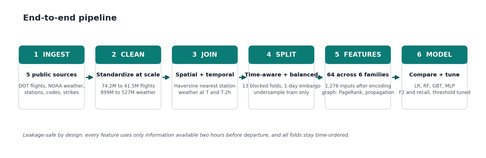
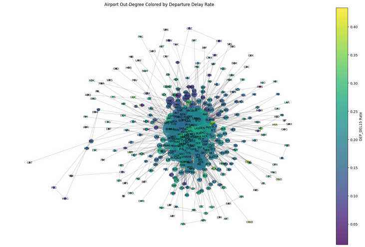

# Flight Delay Prediction at Scale

> Catching more than **8 in 10 real flight delays**, two hours before they happen, from **41.5 million flights** joined to **527 million weather observations**.

Airlines lose money and goodwill every time a delay cascades through their network. The earlier they know a flight is at risk, the more they can do about it: reallocate crews, adjust gates, notify passengers before the disruption spreads. This project predicts whether a U.S. domestic flight will depart 15 or more minutes late, using only information knowable **two hours before scheduled departure**.

## At a glance

| | |
|---|---|
| **Flights modeled** | 41.5M cleaned, from 74.2M raw rows (2015 to 2021) |
| **Weather fused** | 527M NOAA hourly observations |
| **Data sources** | 5 (flights, weather, stations, airport codes, labor strikes) |
| **Features** | 64 across 6 families, 1,276 inputs after encoding |
| **Prediction window** | 2 hours before scheduled departure |
| **Headline result** | 83.6% of real delays caught, F2 of 0.541 |

## How it works

## Network as a feature, not just a map

Airports were modeled as a directed graph rebuilt for every time fold, where node size is connectivity and color is delay rate. PageRank, degree centrality, and delay-propagation features were engineered from this structure to capture how a disruption at one hub ripples outward through aircraft rotations.

## Built to survive the real world, including a pandemic

The data spans seven years, which means it includes the COVID collapse and recovery. Delay rates and flight volumes both crater in 2020 and never fully return to their old shape. Rather than dropping that period, the pipeline was designed to handle the distribution shift head on, with the final three months of 2021 held out as a genuinely unseen test set.

Geography carried real signal too. Delay rates ranged from 26.7% in the West North Central division to 35.2% in the Mid-Atlantic, and a handful of high-volume states concentrated most of the network's risk.

## How it avoids fooling itself

Leakage was the single biggest risk, so it got a dedicated audit.

- Every arrival-side field removed. Weather joined only on same-day, pre-departure observations, falling back to the nearest **prior** hour, never a future one.
- Trend and graph features computed **fold by fold** on training data only.
- Time-aware splits: 13 blocked rolling folds with a one-day embargo, final 3 months of 2021 held out blind.
- Stratified undersampling applied only to training folds, so validation and test kept their natural delay rate.

## Results

A missed delay costs far more than a false alarm, on the order of 10 to 30 times, so the work optimized for **F2 and recall** rather than accuracy. All figures below are on the blind test set (Q4 2021, 1.64M flights).

| Model | F2 | Recall | Precision | AUC-PR |
|---|---|---|---|---|
| **Logistic Regression** (threshold 0.4) | **0.541** | **0.836** | 0.224 | 0.265 |
| Gradient Boosted Trees | 0.461 | 0.546 | **0.284** | **0.303** |
| Random Forest | 0.438 | 0.610 | 0.219 | 0.246 |
| MLP (256 to 128, PyTorch) | 0.442 | 0.509 | 0.290 | 0.306 |

Threshold tuning was the highest-leverage move: shifting the decision threshold from 0.5 to 0.4 lifted F2 by 21% and pushed recall to 83.6%, catching more than 8 in 10 actual delays at no extra training cost. Gradient Boosted Trees gave the strongest ranking ability (AUC-PR 0.303), which makes it the better fit when resources are limited and flights need to be prioritized by risk.

## Key takeaways

- **Scale handled end to end.** 74.2M raw flight rows and 899M weather rows cleaned, joined, and modeled in Spark on Databricks, not sampled down to a laptop-sized toy.
- **Leakage treated as a first-class problem.** Time-aware folds, a one-day embargo, and a strict two-hour information cutoff mean the test numbers reflect real deployment, not optimistic leakage.
- **Metric chosen from the business, not the textbook.** Because a missed delay costs far more than a false alarm, F2 and recall drove every decision, and a simple threshold shift bought a 21% F2 gain for free.
- **Engineering beyond the obvious.** Modeling airports as a graph added PageRank and delay-propagation signal that raw schedule fields cannot capture.
- **Robust to a structural break.** Seven years of data including the COVID collapse forced the pipeline to handle distribution shift head on rather than train on a tidy, stationary world.

## My role

This was a five-person team, and we built across the pipeline rather than in silos. My work spanned data engineering on the large-scale flight-and-weather joins, feature engineering across the network and weather families, exploratory analysis on all six feature groups, model building and evaluation across the Logistic Regression, Random Forest, and Gradient Boosted Trees experiments, and leading the final presentation.

**Team:** Alejandra Rosas, Ambro Quach, Andrei Lupan, Annelise Meyer, Margaret Lubega.

## Tech and methods

PySpark on Databricks, Spark MLlib (Logistic Regression, Random Forest, Gradient Boosted Trees), PyTorch (MLP), GraphFrames for network features, Haversine spatial joins, and blocked time-series cross-validation.

## A note on the code

This project was built and run on UC Berkeley's managed Databricks platform, where the full notebooks and Spark pipeline live. The code is not republished here out of respect for academic integrity, since DATASCI 261 is an active course and its solutions are kept out of circulation. This page is a methodology and results case study built entirely on public U.S. Department of Transportation and NOAA data.

---

UC Berkeley, Master of Information and Data Science. DATASCI 261: Machine Learning at Scale.
